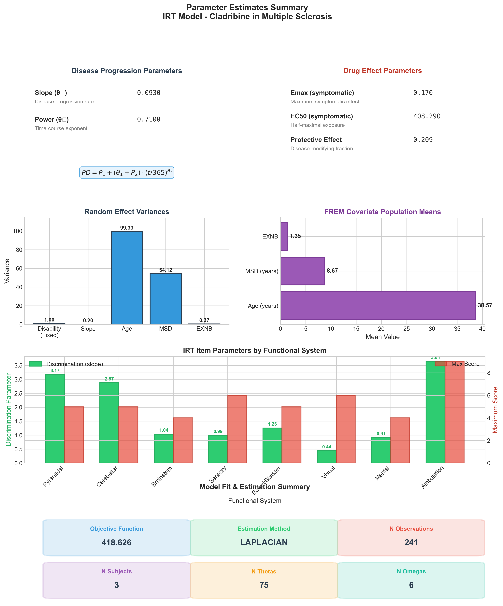
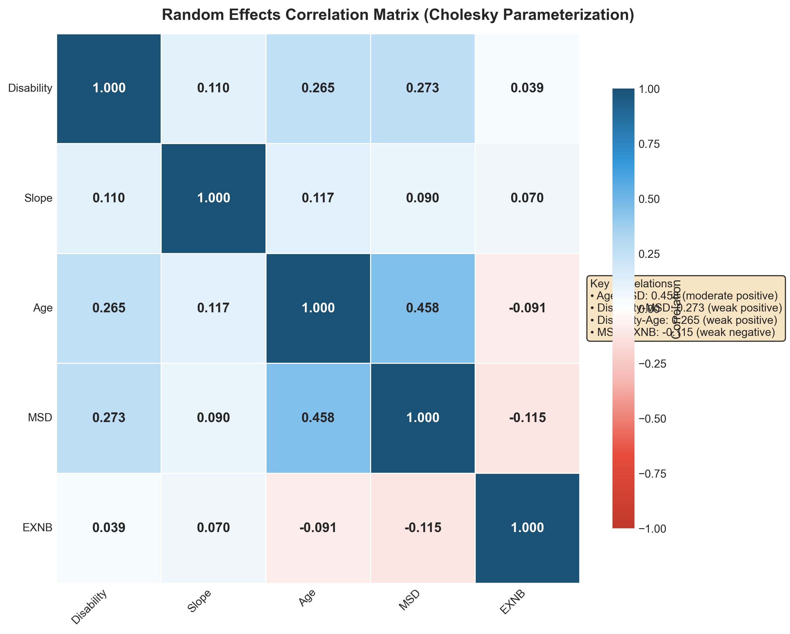
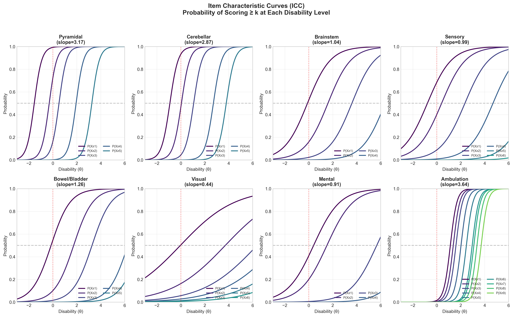
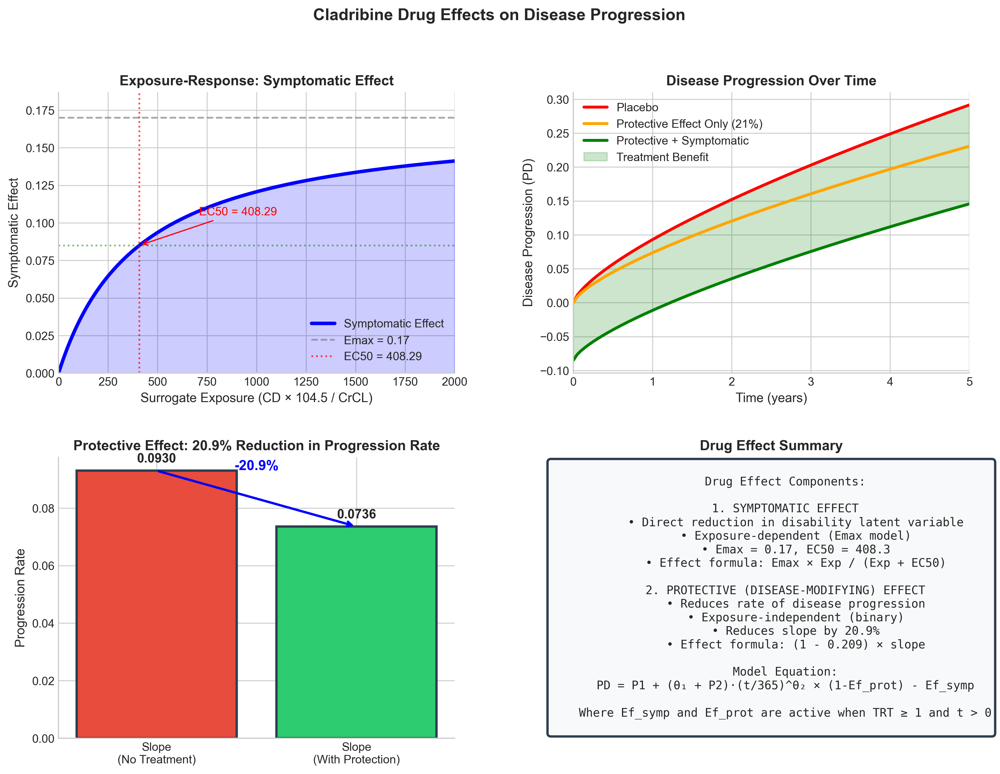
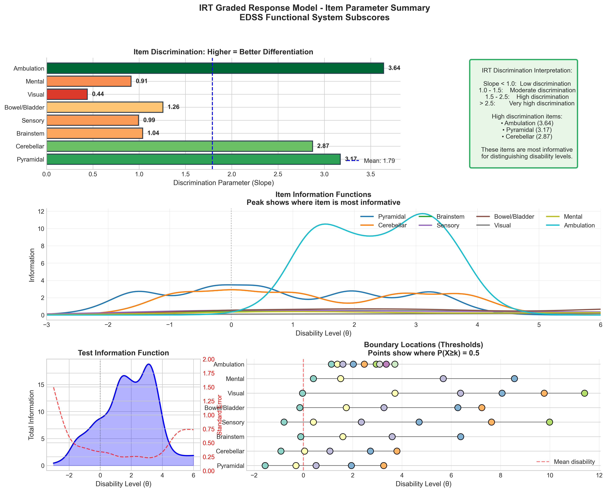

# NONMEM IRT Model Infographics Generator

## 초록 (Korean Abstract)

본 연구는 다발성 경화증(Multiple Sclerosis) 환자에서 클라드리빈(Cladribine) 치료의 효과를 평가하기 위한 항목반응이론(Item Response Theory, IRT) 기반 약동-약력학 모델의 시각화 도구를 제시한다. Novakovic 등(2016)의 NONMEM 출력 파일을 기반으로, 확장장애상태척도(Expanded Disability Status Scale, EDSS)의 8가지 기능계 하위점수를 분석하는 등급반응모델(Graded Response Model)의 주요 파라미터와 모델 구조를 인포그래픽으로 자동 생성한다.

주요 시각화 내용:
- 종적 IRT 모델 구조도
- 모집단 파라미터 추정치 요약
- 무작위 효과 간 상관관계 히트맵
- 항목특성곡선(Item Characteristic Curves)
- 약물 효과(증상 완화 및 질병 진행 억제) 시각화
- IRT 항목 파라미터 요약 (판별도, 정보함수, 경계값)

이 도구는 계량약리학 전문가를 위해 설계되었으며, NONMEM 분석 결과의 해석과 커뮤니케이션을 지원한다.

---

## 要旨 (Japanese Abstract)

本研究は、多発性硬化症（Multiple Sclerosis）患者におけるクラドリビン（Cladribine）治療の効果を評価するための項目反応理論（Item Response Theory, IRT）に基づく薬物動態-薬力学モデルの可視化ツールを提示する。Novakovicら（2016）のNONMEM出力ファイルに基づき、拡大障害状態尺度（Expanded Disability Status Scale, EDSS）の8つの機能系サブスコアを分析する段階反応モデル（Graded Response Model）の主要パラメータとモデル構造をインフォグラフィックとして自動生成する。

主な可視化内容：
- 縦断的IRTモデル構造図
- 母集団パラメータ推定値の要約
- ランダム効果間の相関ヒートマップ
- 項目特性曲線（Item Characteristic Curves）
- 薬物効果（症状緩和および疾患進行抑制）の可視化
- IRT項目パラメータの要約（識別力、情報関数、境界値）

本ツールは計量薬理学の専門家向けに設計されており、NONMEM分析結果の解釈とコミュニケーションを支援する。

---

## Overview

This project generates professional pharmacometric infographics from NONMEM output files for Item Response Theory (IRT) models. The example uses a longitudinal IRT model for cladribine treatment in multiple sclerosis, analyzing EDSS (Expanded Disability Status Scale) functional system subscores.

**Reference:** Novakovic et al., 2016 - Longitudinal Drug Effect Model for EDSS in Multiple Sclerosis

## Model Description

### Disease Progression Model

The latent disability variable (PD) follows a power model with drug effects:

```
PD = P₁ + (θ₁ + P₂) × (t/365)^θ₂ × (1 - Ef_prot) - Ef_symp
```

Where:
- `P₁`: Individual baseline disability (η₁)
- `P₂`: Individual slope random effect (η₂)
- `θ₁`: Population disease progression slope (0.093)
- `θ₂`: Power parameter for time course (0.710)
- `Ef_prot`: Protective (disease-modifying) effect (20.9%)
- `Ef_symp`: Symptomatic effect (Emax model)

### Drug Effect Components

| Effect Type | Parameter | Value | Description |
|-------------|-----------|-------|-------------|
| Symptomatic | Emax | 0.17 | Maximum symptomatic effect |
| Symptomatic | EC50 | 408.29 | Half-maximal exposure |
| Protective | Effect | 0.209 | 20.9% reduction in progression rate |

### IRT Graded Response Model

Eight EDSS functional systems are modeled using IRT:

| Functional System | Score Range | Discrimination (Slope) |
|-------------------|-------------|------------------------|
| Pyramidal | 0-5 | 3.17 |
| Cerebellar | 0-5 | 2.87 |
| Brainstem | 0-4 | 1.04 |
| Sensory | 0-6 | 0.99 |
| Bowel/Bladder | 0-5 | 1.26 |
| Visual | 0-6 | 0.44 |
| Mental | 0-4 | 0.91 |
| Ambulation | 0-9 | 3.64 |

### Random Effects Structure

The model uses Cholesky decomposition for the 5×5 correlation matrix of random effects:
- η₁: Disability (baseline)
- η₂: Slope (progression rate)
- η₃: Age
- η₄: MSD (MS duration)
- η₅: EXNB (Exacerbation number)
- η₆: Drug effect (Emax)

### FREM Covariates

| Covariate | Population Mean |
|-----------|-----------------|
| Age | 38.57 years |
| MS Duration (MSD) | 8.67 years |
| Exacerbation Number (EXNB) | 1.35 |

## Generated Infographics

### 1. Model Structure (`infographic_01_model_structure.png`)


Comprehensive overview of the longitudinal IRT model architecture showing:
- Disease latent variable with structural model equation
- Symptomatic and protective drug effect components
- Random effects (η₁-η₆)
- FREM covariates (Age, MSD, EXNB)
- All 8 EDSS functional system subscores with IRT link

### 2. Parameter Estimates (`infographic_02_parameters.png`)



Summary visualization including:
- Disease progression parameters (slope, power)
- Drug effect parameters (Emax, EC50, protective effect)
- Random effect variances
- FREM covariate population means
- IRT item discrimination parameters by functional system
- Model fit statistics (OFV = 418.626)

### 3. Correlation Matrix (`infographic_03_correlation_matrix.png`)



Heatmap visualization of random effects correlations:
- Strongest correlation: Age-MSD (0.458)
- Disability-MSD: 0.273
- Disability-Age: 0.265
- Negative correlations with EXNB

### 4. Item Characteristic Curves (`infographic_04_icc_curves.png`)



IRT item characteristic curves for all 8 functional systems showing:
- Probability of scoring ≥ k at each disability level
- Discrimination parameter (slope) for each item
- Threshold locations (boundary parameters)

### 5. Drug Effects (`infographic_05_drug_effects.png`)



Comprehensive drug effect visualization:
- Exposure-response curve for symptomatic effect (Emax model)
- Disease progression comparison (placebo vs. treatment)
- Protective effect impact (20.9% reduction)
- Drug effect summary with model equations

### 6. IRT Summary (`infographic_06_irt_summary.png`)



Complete IRT analysis summary:
- Item discrimination comparison (horizontal bar chart)
- Item information functions for all items
- Test information function with standard error
- Boundary (threshold) locations for all functional systems

## Installation & Usage

### Requirements

- Python 3.8+
- matplotlib
- seaborn
- numpy

### Setup

```bash
# Create virtual environment
python3 -m venv venv

# Activate virtual environment
source venv/bin/activate  # macOS/Linux
# or
venv\Scripts\activate     # Windows

# Install dependencies
pip install matplotlib seaborn numpy
```

### Generate Infographics

```bash
python generate_nonmem_infographics.py
```

### Output

All infographics are saved as high-resolution PNG files (300 DPI):
- `infographic_01_model_structure.png`
- `infographic_02_parameters.png`
- `infographic_03_correlation_matrix.png`
- `infographic_04_icc_curves.png`
- `infographic_05_drug_effects.png`
- `infographic_06_irt_summary.png`

## File Structure

```
.
├── README.md
├── generate_nonmem_infographics.py
├── Output_simulated_Novakovic_2016_multiplesclerosis_cladribine_irt.lst
├── Simulated_Novakovic_2016_multiplesclerosis_cladribine_irt.csv
├── infographic_01_model_structure.png
├── infographic_02_parameters.png
├── infographic_03_correlation_matrix.png
├── infographic_04_icc_curves.png
├── infographic_05_drug_effects.png
├── infographic_06_irt_summary.png
└── venv/
```

## Customization

To adapt this script for other NONMEM IRT models:

1. Update the parameter values in the `PARAMETER VALUES FROM NONMEM OUTPUT` section
2. Modify the `IRT_PARAMS` dictionary for different item structures
3. Adjust the model equation in `create_model_overview()` if the structural model differs
4. Update labels and descriptions as needed

## Model Fit Summary

| Metric | Value |
|--------|-------|
| Objective Function Value | 418.626 |
| Estimation Method | Laplacian Conditional Estimation |
| Number of Observations | 241 |
| Number of Subjects | 3 |
| Number of THETAs | 75 |
| Number of OMEGAs | 6 |

## References

1. Novakovic AM, et al. (2016). Longitudinal Item Response Theory Model for Multiple Sclerosis. *CPT: Pharmacometrics & Systems Pharmacology*.

2. Samejima, F. (1969). Estimation of latent ability using a response pattern of graded scores. *Psychometrika Monograph Supplement*, 34(4, Pt. 2), 100.

3. Beal, S., Sheiner, L.B., Boeckmann, A., & Bauer, R.J. (2009). NONMEM User's Guides (1989-2009). Icon Development Solutions, Ellicott City, MD, USA.

## License

This project is provided for educational and research purposes in pharmacometrics.

## Author

Generated using Claude Code - Pharmacometric Infographics Generator

---

*Last updated: December 2025*
